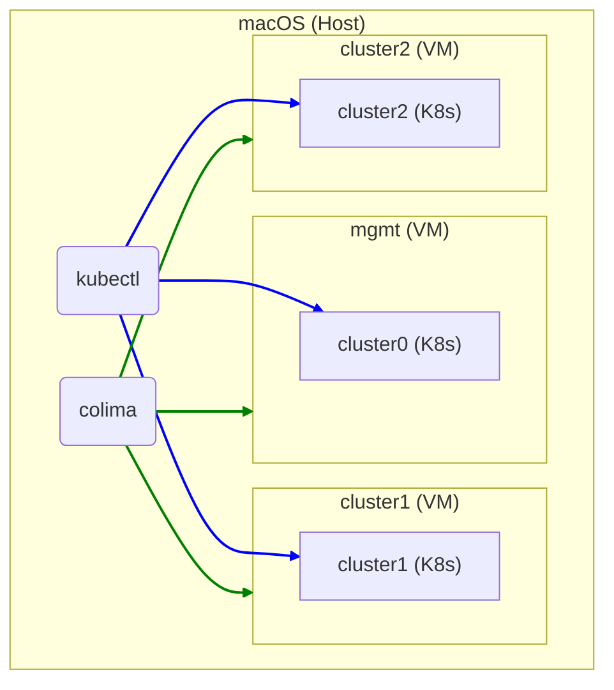
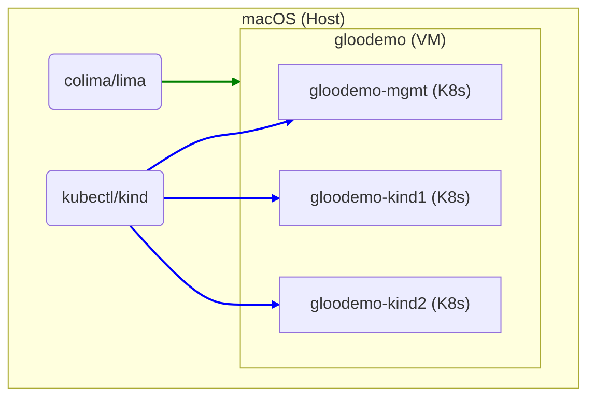

# `kind` on `colima`

## Motivation

I need regular access to several mutually-accessible Kubernetes clusters to use cloud native application networking tools. There are utilities that already exist to help with setting these up on a bare metal system (see [bcollard/kind-on-lima-public](https://github.com/bcollard/kind-on-lima-public) for example), but I wanted to see if I could reduce the complexity of those by using [Colima](https://github.com/abiosoft/colima).

### Doesn't Colima provide a Kubernetes cluster? Why use KinD?

Colima does indeed create a Kubernetes cluster for you if you include the `--kubernetes` flag when starting an instance.

Here's what I'd like:



However, there are two issues at the moment that make this not work on some Macs when using Colima with `--kubernetes` and `--network-address`:

1. When using Apple's Virtualization framework (`--vmType vz`), its `vzNAT` networking does not currently allow each guest VM to access any other guest VM (see https://github.com/lima-vm/lima/pull/1207#issuecomment-1327571829). This means the clusters cannot see each other.
1. When using QEMU (`--vmType qemu`), a bug causes the VM to freeze whenever a new Kubernetes `Service` is created. This only seems to affect Apple Silicon Macs. See https://github.com/abiosoft/colima/issues/683 and https://github.com/abiosoft/colima/issues/458.

These issues rule out using Colima's built-in Kubernetes capability for our multi-cluster purposes, so I'm using [KinD](https://kind.sigs.k8s.io/) instead.

I also encountered some further issues with this approach when using KinD and [MetalLB](https://metallb.universe.tf/). I was unable to get MetalLB's L2 advertisement to work well enough to be able to access `LoadBalancer` services from the Mac host, so I've also taken the approach of having all clusters be created inside a single VM.

## Usage

### Dependencies

Please make sure you have `colima`, `kind`, and `docker` (CLI) installed on macOS. You can ensure this simply with Homebrew:

```shell
brew install colima kind docker
```

### Running the script

At the moment, this script takes no arguments and any deviation from the defaults requires modification to the script.

Run `./create-clusters.sh` and here's what will happen:

1. `colima` will create a new VM named "gloodemo" and set it up with Docker
1. Three `kind` clusters will be created in this VM's Docker host. One will be a "management" cluster ("gloodemo-mgmt") and two will be general purpose ("gloodemo-kind1" and "gloodemo-kind2"). Despite the names, all three clusters are identical
1. MetalLB will be installed in each of the clusters to handle Kubernetes services of type `LoadBalancer`. Each MetalLB instance will have a unique IP address pool on the Docker bridge network, likely `172.18.1x.1`-`172.18.1x.254`
1. The Lima VM will be set up to forward packets from the VM guest network to the Docker bridge network, allowing `LoadBalancer` services to be accessed directly from the macOS host

Once the script has completed, check what you have:

```text
$ colima list
PROFILE      STATUS     ARCH       CPUS    MEMORY    DISK     RUNTIME    ADDRESS
gloodemo     Running    aarch64    4       16GiB     20GiB    docker     192.168.107.5

$ kind get clusters
gloodemo-kind1
gloodemo-kind2
gloodemo-mgmt

$ kubectl config get-contexts
CURRENT   NAME                   CLUSTER                AUTHINFO               NAMESPACE
          kind-gloodemo-kind1    kind-gloodemo-kind1    kind-gloodemo-kind1    
*         kind-gloodemo-kind2    kind-gloodemo-kind2    kind-gloodemo-kind2    
          kind-gloodemo-mgmt     kind-gloodemo-mgmt     kind-gloodemo-mgmt     
```



To finish exposing `LoadBalancer` services to your host, you'll be prompted to run a final step to make sure yor Mac knows how to route to the Docker bridge network (replace `x` with the right value for your Lima VM):

```shell
sudo route -nv delete -net 172.18
sudo route -nv add -net 172.18 192.168.107.x
```
