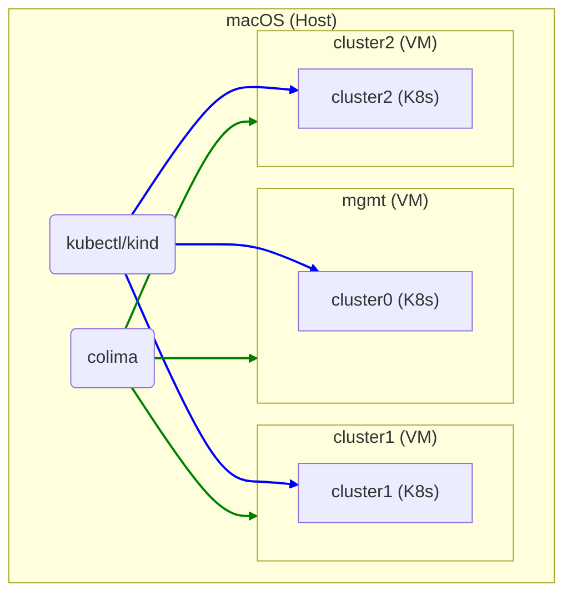

# `kind` on `colima`

## Motivation

I need regular access to several mutually-accessible Kubernetes clusters to use cloud native application networking tools. There are utilities that already exist to help with setting these up on a bare metal system (see [bcollard/kind-on-lima-public](https://github.com/bcollard/kind-on-lima-public) for example), but I wanted to see if I could reduce the complexity of those by using [Colima](https://github.com/abiosoft/colima).

### Doesn't Colima provide a Kubernetes cluster? Why use KinD?

Colima does indeed create a Kubernetes cluster for you if you include the `--kubernetes` flag when starting an instance.

However, there are two issues at the moment that make this not work on some Macs when using Colima with `--kubernetes` and `--network-address`:

1. When using Apple's Virtualization framework (`--vmType vz`), its `vzNAT` networking does not currently allow each guest VM to access any other guest VM (see https://github.com/lima-vm/lima/pull/1207#issuecomment-1327571829). This means the clusters cannot see each other.
1. When using QEMU (`--vmType qemu`), a bug causes the VM to freeze whenever a new Kubernetes `Service` is created. This only seems to affect Apple Silicon Macs. See https://github.com/abiosoft/colima/issues/683 and https://github.com/abiosoft/colima/issues/458.

These issues rule out using Colima's built-in Kubernetes capability for our multi-cluster purposes, so I'm using [KinD](https://kind.sigs.k8s.io/) instead.

## Usage

### Dependencies

Please make sure you have `colima`, `kind`, and `docker` (CLI) installed on macOS. You can ensure this simply with Homebrew:

```shell
brew install colima kind docker
```

### Running the script

> :warning: **This implementation is incomplete**: any `LoadBalancer` services exposed by MetalLB cannot yet be accessed from the host or from other guest VMs.

At the moment, this script takes no arguments and any deviation from the defaults requires modification to the script.

Run `./create-clusters.sh` and here's what will happen:

1. `colima` will create three new VMs named "cluster1", "cluster2", and "mgmt", and set each up with Docker
1. A `kind` cluster will be created in each VM's Docker host, for a total of three identical clusters. They will be named after their VM with a prefix of "`kind-`" (e.g. "kind-cluster1")
1. MetalLB will be installed in each of the clusters to handle Kubernetes services of type `LoadBalancer`. Each MetalLB instance will have a non-overlapping pool of 20 IP addresses on the VM guest network, e.g. `192.168.107.50`-`172.18.107.69`

Once the script has completed, check what you have:

```text
$ colima list
PROFILE      STATUS     ARCH       CPUS    MEMORY    DISK     RUNTIME    ADDRESS
cluster1     Running    x86_64     2       8GiB      20GiB    docker     192.168.107.2
cluster2     Running    x86_64     2       8GiB      20GiB    docker     192.168.107.3
mgmt         Running    x86_64     2       8GiB      20GiB    docker     192.168.107.4

$ kubectl config get-contexts
CURRENT   NAME                   CLUSTER                AUTHINFO               NAMESPACE
          kind-cluster1          kind-cluster1          kind-cluster1          
          kind-cluster2          kind-cluster2          kind-cluster2          
*         kind-mgmt              kind-mgmt              kind-mgmt              
```


